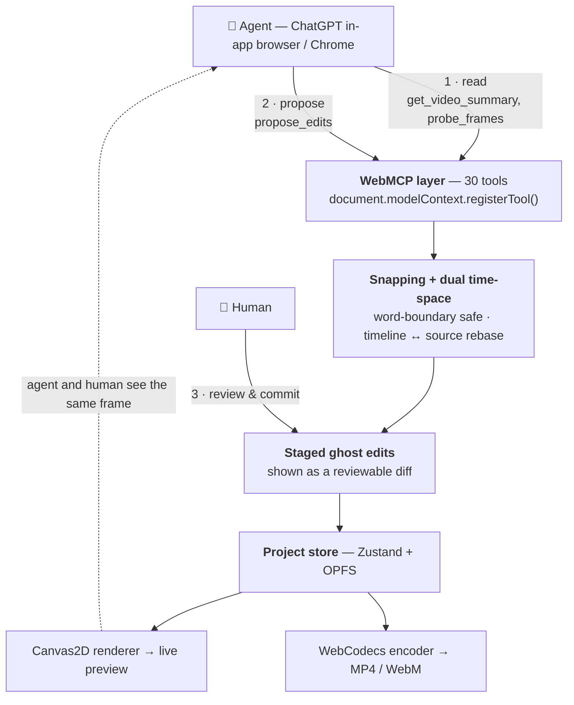

# Panoptik

**A browser-native demo-video studio that an AI agent can edit alongside you.**

Built for the [OpenAI WebMCP Challenge](https://openai.com/webmcp-challenge/).

🔗 **Live demo:** <https://panoptik-studio.vercel.app/> · 🎬 **Demo video:** <https://www.youtube.com/watch?v=naWZF9vwZDE>

---

## What we made

Panoptik is a screen-recording and video editor that runs entirely in the browser — decode, render, audio mixing, and export all happen client-side via WebCodecs and Canvas2D. No uploads, no render farm.

The part that matters for this challenge: **the editor exposes itself to AI agents as 30 WebMCP tools.** An agent running in ChatGPT's in-app browser (or Chrome with the WebMCP flag) can read the project, watch the rendered preview, and propose a complete edit — zooms, cuts, captions, transitions, backgrounds — as a **staged diff** you review and commit.

The agent proposes. The human disposes. Nothing is written to the project without a click.

## Why WebMCP, and not something else

Editing video is the rare task where the agent genuinely has to be *inside the page*:

- **The interesting moments are only visible in the rendered canvas.** "The user clicked Login at 0:08" isn't in the DOM or in any serializable state — it's pixels. A browser-resident agent can already see them. WebMCP gives it a way to *act* on what it sees.
- **A backend MCP server can't reach any of this.** The media lives in OPFS, the project state lives in a Zustand store, the frames live in a canvas. There is no server copy to hand a server-side tool.
- **DOM-driving is the alternative, and it's bad.** Without WebMCP the agent would screenshot the UI, hunt for the timeline, convert "8.0 seconds" into a pixel offset, and drag a diamond. That's ~150KB of screenshots and DOM per action, and it misses. `propose_edits([...])` is one structured call, ~2KB, and it either validates or fails loudly.

So: the agent's vision answers *what's interesting*; WebMCP answers *make it happen*.

## Architecture



Two design decisions carry most of the weight:

**Dual time-space.** Panoptik stores edits in absolute *source* seconds; agents reason in *timeline* seconds. Cuts and speed changes make those diverge. Every tool boundary translates between them, so an agent's timestamps stay correct even after the timeline has been re-cut underneath it.

**Deterministic snapping.** Agent-proposed edits are not applied verbatim. They're snapped: cuts avoid word boundaries (±150ms), zooms centre on real click telemetry, transitions resolve collisions, speed ops are kept from overlapping. The model supplies intent; the engine enforces correctness.

## The tools

<details>
<summary><b>Read</b> — understand the video (10 tools)</summary>

`get_video_summary` · `get_scene_detail` · `get_project_state` · `list_clips` · `list_scenes` · `get_transcript` · `get_silence_intervals` · `get_click_log` · `inspect_timeline` · `get_director_guidelines`

`get_video_summary` is the entry point: transcript phrases, scene breakdown, silence intervals, dead air, facecam position, and the director playbook — in one call. `get_scene_detail` drills into a single scene rather than paying for the whole thing.
</details>

<details>
<summary><b>See</b> — ground claims in actual pixels (2 tools)</summary>

`probe_frames` — samples frames at given timestamps, returns base64 snapshots with an optional A1–C3 grid overlay for visual grounding.

`locate_visual_target` — turns "zoom on the search bar" into a safe focal point via three tiers: click telemetry (confidence 1.0) → parsed VLM bounding box / grid cell → centred fallback.
</details>

<details>
<summary><b>Edit</b> — propose changes (13 tools)</summary>

`propose_edits` — the main tool: one atomic batch of cut / zoom / text / speed / transition / background ops, snapped and applied together.

Single-purpose tools for narrower asks: `propose_zoom_points` · `add_text_overlay` · `generate_captions` · `set_background` · `split_clip` · `delete_clip` · `set_clip_transition` · `set_clip_speed` · `set_aspect` · `add_music`, plus `split_segment` and `set_speed` kept as compatibility aliases.
</details>

<details>
<summary><b>Commit & export</b> — human-gated (5 tools)</summary>

`commit_staged_changes` (opens the diff dialog) · `discard_staged_changes` · `export_clip` (confirm-gated, encodes locally and hands back a download) · `ai_auto_director` (one-click full edit plan) · `cloud_transcribe`
</details>

## Try it

```bash
git clone https://github.com/Panoptik-Studio/Panoptik.git
cd Panoptik
pnpm install
pnpm dev
```

Open <http://localhost:3000/editor>. Requires Node 20+ and a Chromium browser (WebCodecs + OPFS).

**To drive it with an agent:**

1. **ChatGPT in-app browser** — open Panoptik there and the tools register themselves.
2. **Chrome** — enable `chrome://flags/#enable-webmcp-testing`.
3. **DevTools console** — no agent needed:
   ```js
   await window.__panoptik_call_tool("get_video_summary");
   await window.__panoptik_call_tool("propose_zoom_points", { timestamps: [2.5, 6.0], scale: 2.2 });
   ```

Every call — input, duration, output — shows up live in the **Agent Tool Trace** panel. The full agent protocol is in [docs/LLM_WEBMCP_DIRECTOR_GUIDE.md](docs/LLM_WEBMCP_DIRECTOR_GUIDE.md).

## What stays on your machine

All video work is local: decoding, rendering, zoom, transitions, audio mixing, and MP4/WebM export never touch a network.

The exceptions are opt-in and named as such: speech-to-text (Groq Whisper, via your own key or a hosted proxy) and `ai_auto_director`. **Air-gapped mode** blocks both and keeps the local tool pipeline working.

## Repo layout

```
apps/web/           Next.js editor
  src/webmcp/         ← the WebMCP layer: tools, snapping, time-space, lifecycle
  src/components/     Timeline, PreviewCanvas, Inspector, ToolTrace
  src/stores/         Zustand project store with undo/redo
packages/engine/    decode · render · encode · audio · timeStretch · record · opfs
packages/project-schema/   Project types + migrations
packages/utils/     Shared math and easings
```

```bash
pnpm test        # unit + integration suites
pnpm typecheck   # tsc across the monorepo
```

## Also in the box

Zoom keyframes with easing · distributed cross-cut transitions (fade, dip, slide, wipe, zoom) · facecam PiP with shape/border/glow styling that morphs across cuts · multi-track audio with auto-ducking · WSOLA pitch-preserving speed changes · OPFS project persistence · export to MP4 (H.264/AAC) or WebM (VP9/Opus) at up to 4K/60.

## License

AGPL-3.0 for the app (`apps/web`); MIT for the engine and schema packages.
