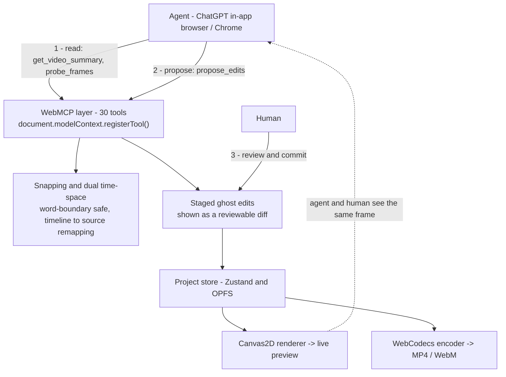

# Panoptik

A browser-native demo-video studio that an AI agent can edit alongside you.

Built for the [OpenAI WebMCP Challenge](https://openai.com/webmcp-challenge/).

Live demo: <https://panoptik-studio.vercel.app/> | Demo video: <https://www.youtube.com/watch?v=naWZF9vwZDE>

---

## What we made

Panoptik is a screen recording and video editor that runs completely inside the browser. Decoding, rendering, audio mixing, and exporting all happen on your computer using WebCodecs and Canvas2D. There are no file uploads and no remote render servers.

The main feature for this challenge: the editor gives AI agents 30 WebMCP tools. When an agent runs inside ChatGPT's in-app browser (or in Chrome with the WebMCP testing flag), it can inspect the project, watch the canvas preview, and propose edits like zooms, cuts, subtitles, transitions, and backgrounds as a staged diff that you review and confirm.

The agent proposes edits, and the human decides. Nothing is changed in the project until you click to accept.

## Why WebMCP, and not something else

Video editing needs the agent to work directly inside the web page:

- The important events only exist in the canvas pixels. For example, when a user clicks a button at 0:08, that action is not in the DOM or in any text state. It is only in the rendered video frames. A browser-resident agent can see these pixels directly. WebMCP gives the agent a clean way to take action on what it sees.
- A backend MCP server cannot reach client data. The video file stays in browser storage (OPFS), the timeline state is in a local Zustand store, and the frames are on a canvas. There is no copy on a server for a backend tool to use.
- Controlling the DOM with mouse clicks is slow and fragile. Without WebMCP, an agent would have to take a screenshot of the UI, search the DOM for the timeline, convert seconds into screen pixels, and simulate dragging keyframes. That takes around 150 KB of images and DOM text for every action, and it often fails. With WebMCP, `propose_edits([...])` is a single structured tool call of about 2 KB that either works cleanly or returns a clear error.

The agent's vision finds what is interesting, and WebMCP makes the changes happen.

## Architecture



Two main design choices make this work:

Dual time-space. Panoptik stores all edits in source seconds, but agents think in timeline seconds. When clips are cut or speed is changed, these two times become different. Every tool automatically converts between them, so the agent's timestamps stay accurate even after previous cuts change the timeline.

Deterministic snapping. The engine does not apply agent proposals blindly. It snaps cuts so they do not chop words (+/- 150ms), centers zooms on recorded mouse clicks, avoids transition overlaps, and stops speed changes from colliding. The model gives the creative idea, and the engine makes sure the math is correct.

## The tools

<details>
<summary>Read - inspect the video (10 tools)</summary>

`get_video_summary`, `get_scene_detail`, `get_project_state`, `list_clips`, `list_scenes`, `get_transcript`, `get_silence_intervals`, `get_click_log`, `inspect_timeline`, `get_director_guidelines`

`get_video_summary` is the first tool to call: it returns transcript text, scenes, silence periods, dead air, camera position, and editor guidelines in one response. `get_scene_detail` lets the agent look closely at one specific scene without downloading the whole project data.
</details>

<details>
<summary>See - check actual frame pixels (2 tools)</summary>

`probe_frames` - takes sample frames at chosen timestamps and returns image information with an optional A1-C3 grid for visual grounding.

`locate_visual_target` - converts an instruction like "zoom on the search bar" into coordinates using three fallback steps: recorded click data (confidence 1.0), then visual model grid detection, then center fallback.
</details>

<details>
<summary>Edit - propose changes (13 tools)</summary>

`propose_edits` - the main tool: runs a single batch of cut, zoom, text, speed, transition, and background changes together with snapping.

Smaller tools for single tasks: `propose_zoom_points`, `add_text_overlay`, `generate_captions`, `set_background`, `split_clip`, `delete_clip`, `set_clip_transition`, `set_clip_speed`, `set_aspect`, `add_music`, plus `split_segment` and `set_speed` for backward compatibility.
</details>

<details>
<summary>Commit and export - human approval required (5 tools)</summary>

`commit_staged_changes` (shows the diff confirmation box), `discard_staged_changes`, `export_clip` (asks for confirmation, then encodes locally and gives a download link), `ai_auto_director` (creates a full edit plan), `cloud_transcribe`
</details>

## Try it

```bash
git clone https://github.com/Panoptik-Studio/Panoptik.git
cd Panoptik
pnpm install
pnpm dev
```

Open <http://localhost:3000/editor>. This needs Node 20+ and a Chromium browser with WebCodecs and OPFS support.

To use it with an AI agent:

1. ChatGPT in-app browser: open Panoptik there and the tools register automatically.
2. Chrome: enable `chrome://flags/#enable-webmcp-testing`.
3. DevTools console (no agent needed):
   ```js
   await window.__panoptik_call_tool("get_video_summary");
   await window.__panoptik_call_tool("propose_zoom_points", { timestamps: [2.5, 6.0], scale: 2.2 });
   ```

Every tool call shows up live in the Agent Tool Trace box with its name, time taken, and return value. The guide for agents is in [docs/LLM_WEBMCP_DIRECTOR_GUIDE.md](docs/LLM_WEBMCP_DIRECTOR_GUIDE.md).

## What stays on your machine

All video processing stays on your computer. Decoding, rendering, zooms, transitions, audio mixing, and export to MP4 or WebM never send video data across the network.

The only optional network features are speech transcription (Groq Whisper, with your own key or free proxy) and `ai_auto_director`. Air-gapped mode turns both off and keeps all local editing tools working.

## Repo layout

```
apps/web/           Next.js editor
  src/webmcp/         <- WebMCP layer: tools, snapping, time translation, lifecycle
  src/components/     Timeline, PreviewCanvas, Inspector, ToolTrace
  src/stores/         Zustand project store with undo and redo
packages/engine/    decode, render, encode, audio, timeStretch, record, opfs
packages/project-schema/   Project types and migrations
packages/utils/     Shared math and easing functions
```

```bash
pnpm test        # unit and integration tests
pnpm typecheck   # typescript check across the monorepo
```

## Also included

Smooth zoom keyframes with easing curves, transitions between cuts (fade, dip, slide, wipe, zoom), facecam picture-in-picture with shapes and borders, multi-track audio with automatic ducking, pitch-preserving speed changes using WSOLA, project saving with OPFS, and export to MP4 (H.264/AAC) or WebM (VP9/Opus) up to 4K at 60 fps.

## License

AGPL-3.0 for the web app (`apps/web`); MIT for the engine and schema packages.
