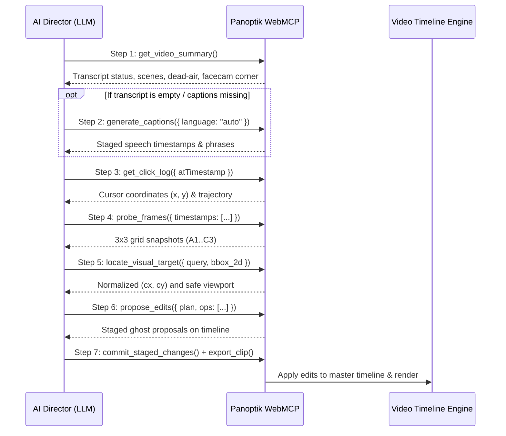

# LLM AI Video Director: WebMCP Reasoning & Tool Execution Guide

This guide establishes the standard reasoning framework and tool execution workflow for Large Language Models (LLMs) and AI agents acting as the **Autonomous Video Director** inside Panoptik via the WebMCP protocol.

---

## 1. Core Philosophy of AI Video Directing

Video directing requires **multimodal spatial-temporal reasoning**:

```
           ┌──────────────────────────────────────────────┐
           │ 1. Spoken Transcript & Narrative Intent      │
           │    (What is the creator saying or reading?)  │
           └──────────────────────┬───────────────────────┘
                                  │
                                  ▼
           ┌──────────────────────────────────────────────┐
           │ 2. Continuous Cursor Telemetry & Clicks      │
           │    (Where is the creator pointing / looking?)│
           └──────────────────────┬───────────────────────┘
                                  │
                                  ▼
           ┌──────────────────────────────────────────────┐
           │ 3. Computer Vision Frame Probing (3x3 Grid)  │
           │    (What are the visual bounds of the UI?)   │
           └──────────────────────┬───────────────────────┘
                                  │
                                  ▼
           ┌──────────────────────────────────────────────┐
           │ 4. Batched Smooth Proposal (WebMCP)          │
           │    (Sequential pan/zooms + camera keepouts)  │
           └──────────────────────────────────────────────┘
```

### Key Principles:
1. **Core Content vs. Incidental Setup**:
   * **Incidental Setup**: Toggling subtitles, adjusting player volume, switching tabs, or closing popups. Do **NOT** zoom into incidental settings unless specifically requested.
   * **Core Content**: Reading out loud, reacting to on-screen text/comments, demonstrating code lines, or clicking primary action buttons. **ALWAYS** zoom into these moments.
2. **Sequential Multi-Item Tracking vs. Single Static Zoom**:
   * When a creator reads or explains multiple items in sequence (e.g. 3 comments, 4 list items, or multiple code blocks), **never place a single stationary zoom** at high magnification ($2.2\times+$), as it clips earlier/later items.
   * Instead, create **sequential focal transitions** (e.g. Zoom 1 at $y=0.48 \rightarrow$ Pan to Zoom 2 at $y=0.68$).
3. **Safe Viewport Framing**:
   * Use **$1.6\times - 1.8\times$** for text cards and comments to ensure ample horizontal padding and zero word clipping.
   * Reserve **$2.0\times - 2.5\times$** for compact UI controls, icons, or specific words.
4. **Facecam Keepout Protection**:
   * Inspect the `actualCamCorner` (e.g. `'br'`) to ensure zoom focal centers never collide with the camera bubble or closed captions.

---

## 2. The Standard 7-Step WebMCP Protocol

Every autonomous LLM director follows this sequence:



---

## 3. Step-by-Step Tool Reference & Snippets

### Step 1: Ingest Video Digest & Check Metadata
Inspect the high-level semantic summary, spoken phrases, and facecam position:

```js
const digest = await window.__panoptik_call_tool("get_video_summary");
console.log("=== Transcript Status ===", digest.transcript ? "Ready" : "Missing");
console.log("=== Project Meta ===", digest.project);
```

### Step 2: Auto-Generate Captions (If Missing)
If `digest.transcript` is empty or captions have not yet been transcribed, generate them immediately to produce the speech timestamps needed for zoom & overlay planning:

```js
if (!digest.transcript || digest.transcript.trim().length === 0) {
  console.log("Transcript missing — generating Whisper captions...");
  const captions = await window.__panoptik_call_tool("generate_captions", {
    language: "auto"
  });
  console.log("Captions Generated:", captions);
}
```

### Step 3: Extract Continuous Cursor Telemetry
Find the human focal point $(x, y)$ where the mouse hovered or clicked during speech intervals:

```js
// Query trajectory around a specific speech moment (e.g. at 87.5s):
const cursorInfo = await window.__panoptik_call_tool("get_click_log", {
  atTimestamp: 87.5
});
console.log("Cursor Focal Point at 87.5s:", cursorInfo.cursor);
```

### Step 4: Visually Probe Frames with 3×3 Grid
Grab snapshot images with labeled coordinate grids (`A1` to `C3`) to inspect the layout:

```js
const probe = await window.__panoptik_call_tool("probe_frames", {
  timestamps: [87.5, 104.0],
  includeSnapshot: true,
  gridOverlay: true
});
console.log("Frame Snapshots:", probe.frames);
```

### Step 5: Ground Visual Targets & Margins
Resolve bounding boxes into normalized centers while checking for safe margins:

```js
const target = await window.__panoptik_call_tool("locate_visual_target", {
  query: "Upper comments section",
  timestamp: 87.5,
  scale: 1.8,
  vlmOutput: JSON.stringify({
    object_present: true,
    grid_cell: "B1",
    bbox_2d: [350, 40, 600, 600],
    confidence: 0.95
  })
});
console.log("Grounded Center:", target.normalizedCenter); // { x: 0.28, y: 0.48 }
```

### Step 6: Propose Batched Edits (`propose_edits`)
Stage atomic edit operations with smooth cubic easing (`io3`):

```js
const proposal = await window.__panoptik_call_tool("propose_edits", {
  plan: "Sequential comments zoom: 1) Upper comments at 87s (cx=0.28, cy=0.48), 2) Pan to lower comments at 104s (cx=0.30, cy=0.68). Facecam locked in bottom-right.",
  mode: "replace",
  ops: [
    // 1. First sequential zoom
    {
      op: "zoom",
      t0: 87.0,
      t1: 103.0,
      scale: 1.8,
      cx: 0.28,
      cy: 0.48,
      ease: "io3"
    },

    // 2. Second sequential zoom
    {
      op: "zoom",
      t0: 104.0,
      t1: 126.0,
      scale: 1.8,
      cx: 0.30,
      cy: 0.68,
      ease: "io3"
    },

    // 3. Keep Facecam in Bottom-Right
    {
      op: "cam",
      corner: "br"
    },

    // 4. Backdrop Style
    {
      op: "bg",
      kind: "gradient",
      c0: "#0f172a",
      c1: "#1e293b"
    }
  ]
});
```

### Step 7: Commit and Render
Commit the staged proposals to the master timeline and trigger the final video render:

```js
// 1. Commit to timeline
const commit = await window.__panoptik_call_tool("commit_staged_changes");
console.log("Commit Result:", commit);

// 2. Export final clip
const render = await window.__panoptik_call_tool("export_clip", {
  resolution: "1080p",
  format: "mp4"
});
console.log("Exported Clip:", render);
```

---

---

## 4. AI Text Overlay Workflow (Titles, Facts, Chapters, Quotes)

In addition to camera zooms, the AI Director can stage dynamic on-screen text overlays to improve viewer retention and narrative clarity.

### ⚠️ Strict Typography Rule: NO Emojis
* **Do NOT use emojis** (e.g. 🚀, 🤖, 🔥, ✨, 💡, 📌) in titles, headers, badges, or quote callouts. Emojis look cartoonish and cheapen technical demos.
* **Use clean typographic hierarchy**: Bold font weights, crisp letter spacing, clean title case, or concise uppercase labels (e.g. `FEATURE:`, `OVERVIEW:`, `NOTE:`).

### The 4 Overlay Categories & Triggers:

| Overlay Type | Duration | Placement | LLM Trigger in Transcript | Example |
| :--- | :--- | :--- | :--- | :--- |
| **1. Hook Title** | 3.5s | `pos: "top"` | First 5s: Creator introduces self/topic. | `"GITHUB PROJECTS & ARCHITECTURE WALKTHROUGH"` |
| **2. Fact / Context Pill** | 3.5s | `pos: "top"` or `"bottom"` | Product/tool/version/pricing mention. | `"NOTE: Available in Claude Pro & Team Plans"` |
| **3. Chapter Marker** | 3.0s | `pos: "top"` | Topic shift (*"Let's read comments..."*). | `"SECTION: Community Feedback"` |
| **4. Quote / Punchline** | 2.5s | `pos: "bottom"` | Memorable joke or key quote. | `"'The golden age of software'"` |

### Available Styling & Animation Controls:

Both `propose_edits` (via `op: "text"`) and `add_text_overlay` support complete typographic and animation customization:

| Property | Type / Options | Default | Description |
| :--- | :--- | :--- | :--- |
| `fontFamily` | `'Inter'`, `'Outfit'`, `'Montserrat'`, `'Playfair Display'`, `'Fira Code'` | `'Inter'` | Typography face. |
| `fontSize` | Number ($14\text{px} - 64\text{px}$) | `36` | Text size in canvas pixels. |
| `fontWeight` | `'normal'`, `'600'`, `'bold'`, `'800'`, `'900'` | `'bold'` | Font weight. |
| `fontStyle` | `'normal'`, `'italic'` | `'normal'` | Font style (use `italic` for quotes). |
| `color` | Hex / RGBA (e.g. `'#ffffff'`, `'#facc15'`, `'#38bdf8'`) | `'#ffffff'` | Text fill color. |
| `backgroundColor`| Hex / RGBA (e.g. `'rgba(15,23,42,0.85)'`, `'#1e293b'`) | `none` | Backdrop container pill color. |
| `borderRadius` | Number ($0 - 24\text{px}$) | `10` | Corner rounding for backdrop pill. |
| `animation` | `'none'`, `'fade'`, `'pop'`, `'slide-up'`, `'slide-down'`, `'zoom-in'`, `'typewriter'`, `'bounce'` | `'fade'` | Entrance/exit animation curve. |
| `animationDuration` | Number ($0.15\text{s} - 0.8\text{s}$) | `0.35` | Entrance/exit animation duration. |
| `duration` | Number ($1.0\text{s} - 30.0\text{s}$) | `3.0` | Total on-screen display duration. |

### Spatial Coordination Rules with Zooms & Facecam:
* **Avoid Obscuring Zooms**:
  * If an active zoom focuses on the **top half** ($cy \le 0.45$), place overlays at `pos: "bottom"`.
  * If an active zoom focuses on the **bottom half** ($cy \ge 0.55$), place overlays at `pos: "top"`.
* **Facecam Keepout**:
  * When `actualCamCorner === 'br'`, `pos: "bottom"` overlays are centered automatically, safely clearing the right corner.

---

## 5. Common Edge Cases & LLM Heuristics

| Scenario | Symptom | LLM Director Solution |
| :--- | :--- | :--- |
| **Multiple Comments in Video** | Single high zoom ($2.2\times$) cuts off the top/bottom comments. | Break into separate $1.8\times$ zooms matching the transcript timestamps for each comment. |
| **Subtitle/Quality Selection** | Spoke while changing player gear icon. | Treat settings adjustments as incidental setup; do not zoom unless it is a tutorial on player settings. |
| **Facecam Overlap** | Camera in bottom-right covers bottom captions. | Use `resolveBestCamCorner` with cursor collision penalty and `bl` title keepout. |
| **Silent Pauses / Hum** | Background fan noise during pauses. | Engine noise gating suppresses silence; only zoom when voice activity energy is positive. |
| **Text Overlay Clutter** | Multiple text cards overlapping. | Never schedule two overlays at the exact same timestamp; separate by at least 4s. |

---

## 6. End-to-End Case Study: Technical Project & PR Walkthrough

Here is a full real-world reasoning trace from a 153-second technical walkthrough video:

### 1. Ingested Transcript & Visual Cues
* `[00:04.0 - 00:11.5]`: *"Hello guys, today I am going to show you and explain you my GitHub project."*
* `[00:32.6 - 00:46.5]`: *"this is my github profile... about me section... feature product section... contribution section... commit..."*
* `[00:54.5 - 01:00.7]`: *"here is a recent CR that got merged into SMD async..."*
* `[01:06.6 - 01:34.7]`: *"what does this PR do? Implements a deadline proximity histogram... SLO early warning for batches... expire simultaneously... 13 buckets up to 24 hours..."*
* `[01:45.0 - 02:23.0]`: *"and here the suggestion that the reviewer gave me... bucket based approach... code got merged..."*

### 2. Step-by-Step AI Director Reasoning
1. **Intro ($t=1.0\text{s}$)**: Creator is introducing the video topic $\rightarrow$ Stage Hook Title `"GITHUB PROJECTS & PR WALKTHROUGH"` (no emojis) at `pos: "top"` for 3.5s.
2. **Profile Walkthrough ($t=32.5\text{s} - 49.0\text{s}$)**: Creator is explaining their profile, bio, and contribution heatmap $\rightarrow$ Stage Chapter Marker `"PROFILE & CONTRIBUTION ACTIVITY"` at `pos: "top"` and zoom out slightly with wide framing (`scale = 1.6`, `cx = 0.40, cy = 0.45`).
3. **Merged PR Highlight ($t=54.5\text{s} - 61.0\text{s}$)**: Creator focuses on the merged pull request header $\rightarrow$ Stage Context Pill `"MERGED PR: SMD Async Pipeline"` and zoom in tightly on the PR badge (`scale = 1.8`, `cx = 0.35, cy = 0.32`).
4. **Architecture & SLO Histogram ($t=106.0\text{s} - 135.0\text{s}$)**: Deep explanation of the technical problem and queue backlog $\rightarrow$ Stage Feature Marker `"ARCHITECTURE: Deadline Proximity Histogram"` and zoom onto the architectural description box (`scale = 1.8`, `cx = 0.38, cy = 0.52`).
5. **Code Review Diff ($t=144.5\text{s} - 152.5\text{s}$)**: Creator reviews a comment thread and code diff $\rightarrow$ Stage Callout Overlay `"REVIEWER FEEDBACK: Bucket-Based Approach"` at `pos: "bottom"` (inverting to bottom since the zoom targets center-left) and zoom onto the review thread (`scale = 1.8`, `cx = 0.42, cy = 0.62`).
6. **Facecam Safety**: Camera is in bottom-right (`'br'`) $\rightarrow$ all bottom text overlays are centered and zooms leave the bottom-right clear.

### 3. Resulting WebMCP Execution Payload
```js
const stagedEdits = await window.__panoptik_call_tool("propose_edits", {
  plan: "Technical GitHub walkthrough: 1) Intro hook title, 2) Zoom on profile & contribution graph at 33s, 3) Zoom on merged PR at 55s, 4) Zoom on SLO histogram description at 106s, 5) Zoom on reviewer feedback diff at 145s with clean typographic overlays. Facecam protected in bottom-right.",
  mode: "replace",
  ops: [
    // 1. Intro Hook Title
    { op: "text", t: 1.0, dur: 3.5, text: "GITHUB PROJECTS & PR WALKTHROUGH", pos: "top" },

    // 2. Profile Section
    { op: "text", t: 32.5, dur: 3.5, text: "PROFILE & CONTRIBUTION ACTIVITY", pos: "top" },
    { op: "zoom", t0: 33.0, t1: 49.0, scale: 1.6, cx: 0.40, cy: 0.45, ease: "io3" },

    // 3. Merged PR Header
    { op: "text", t: 54.5, dur: 3.5, text: "MERGED PR: SMD Async Pipeline", pos: "top" },
    { op: "zoom", t0: 54.5, t1: 61.0, scale: 1.8, cx: 0.35, cy: 0.32, ease: "io3" },

    // 4. PR Architecture & Description
    { op: "text", t: 106.0, dur: 3.5, text: "ARCHITECTURE: Deadline Proximity Histogram", pos: "top" },
    { op: "zoom", t0: 106.5, t1: 135.0, scale: 1.8, cx: 0.38, cy: 0.52, ease: "io3" },

    // 5. Code Review Diff & Discussion
    { op: "text", t: 144.5, dur: 3.5, text: "REVIEWER FEEDBACK: Bucket-Based Approach", pos: "bottom" },
    { op: "zoom", t0: 145.0, t1: 152.5, scale: 1.8, cx: 0.42, cy: 0.62, ease: "io3" },

    // Facecam & Backdrop
    { op: "cam", corner: "br" },
    { op: "bg", kind: "gradient", c0: "#0f172a", c1: "#1e293b" }
  ]
});
```

