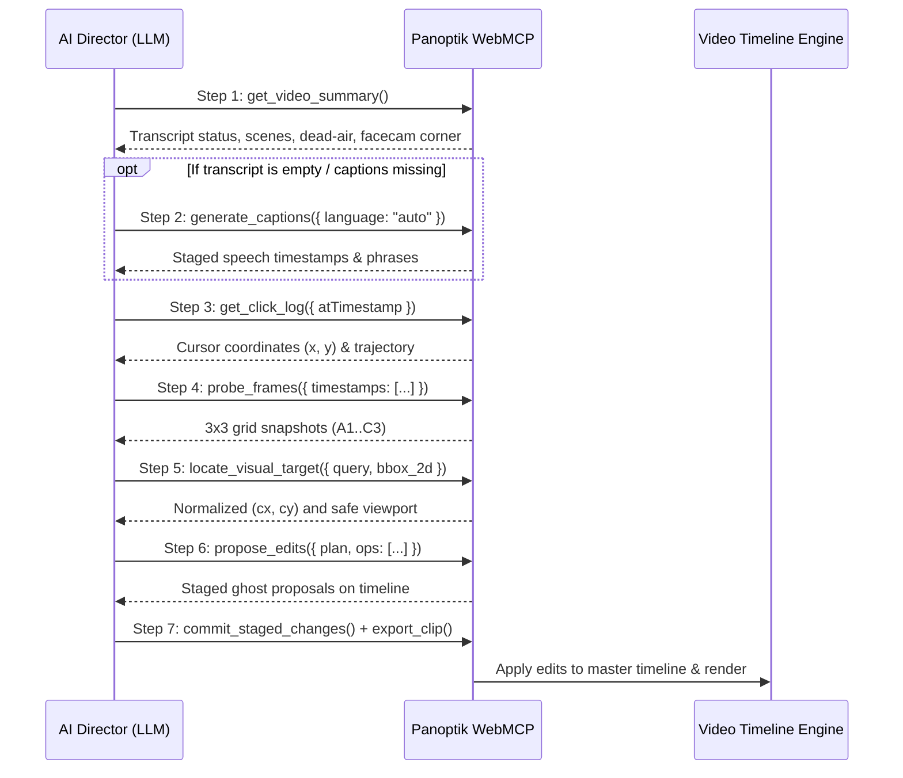
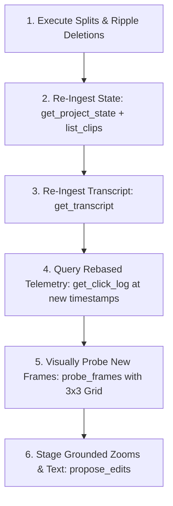

# LLM AI Video Director: WebMCP Reasoning & Tool Execution Guide

This guide establishes the standard reasoning framework and tool execution workflow for Large Language Models (LLMs) and AI agents acting as the **Autonomous Video Director** inside Panoptik via the WebMCP protocol.

---

## 1. Core Philosophy of AI Video Directing

Video directing requires **multimodal spatial-temporal reasoning**:

```
           ┌──────────────────────────────────────────────┐
           │ 1. Spoken Transcript & Narrative Intent      │
           │    (What is the creator saying or reading?)  │
           └──────────────────────┬───────────────────────┘
                                  │
                                  ▼
           ┌──────────────────────────────────────────────┐
           │ 2. Continuous Cursor Telemetry & Clicks      │
           │    (Where is the creator pointing / looking?)│
           └──────────────────────┬───────────────────────┘
                                  │
                                  ▼
           ┌──────────────────────────────────────────────┐
           │ 3. Computer Vision Frame Probing (3x3 Grid)  │
           │    (What are the visual bounds of the UI?)   │
           └──────────────────────┬───────────────────────┘
                                  │
                                  ▼
           ┌──────────────────────────────────────────────┐
           │ 4. Batched Smooth Proposal (WebMCP)          │
           │    (Sequential pan/zooms + camera keepouts)  │
           └──────────────────────────────────────────────┘
```

### Key Principles:
1. **Core Content vs. Incidental Setup**:
   * **Incidental Setup**: Toggling subtitles, adjusting player volume, switching tabs, or closing popups. Do **NOT** zoom into incidental settings unless specifically requested.
   * **Core Content**: Reading out loud, reacting to on-screen text/comments, demonstrating code lines, or clicking primary action buttons. **ALWAYS** zoom into these moments.
2. **Sequential Multi-Item Tracking vs. Single Static Zoom**:
   * When a creator reads or explains multiple items in sequence (e.g. 3 comments, 4 list items, or multiple code blocks), **never place a single stationary zoom** at high magnification ($2.2\times+$), as it clips earlier/later items.
   * Instead, create **sequential focal transitions** (e.g. Zoom 1 at $y=0.48 \rightarrow$ Pan to Zoom 2 at $y=0.68$).
3. **Safe Viewport Framing**:
   * Use **$1.6\times - 1.8\times$** for text cards and comments to ensure ample horizontal padding and zero word clipping.
   * Reserve **$2.0\times - 2.5\times$** for compact UI controls, icons, or specific words.
4. **Facecam Keepout Protection**:
   * Inspect the `actualCamCorner` (e.g. `'br'`) to ensure zoom focal centers never collide with the camera bubble or closed captions.

---

## 2. The Standard 7-Step WebMCP Protocol

Every autonomous LLM director follows this sequence:



---

## 3. Step-by-Step Tool Reference & Snippets

### Step 1: Ingest Video Digest & Check Metadata
Inspect the high-level semantic summary, spoken phrases, and facecam position:

```js
const digest = await window.__panoptik_call_tool("get_video_summary");
console.log("=== Transcript Status ===", digest.transcript ? "Ready" : "Missing");
console.log("=== Project Meta ===", digest.project);
```

### Step 2: Auto-Generate Captions (If Missing)
If `digest.transcript` is empty or captions have not yet been transcribed, generate them immediately to produce the speech timestamps needed for zoom & overlay planning:

```js
if (!digest.transcript || digest.transcript.trim().length === 0) {
  console.log("Transcript missing — generating Whisper captions...");
  const captions = await window.__panoptik_call_tool("generate_captions", {
    language: "auto"
  });
  console.log("Captions Generated:", captions);
}
```

### Step 3: Extract Continuous Cursor Telemetry
Find the human focal point $(x, y)$ where the mouse hovered or clicked during speech intervals:

```js
// Query trajectory around a specific speech moment (e.g. at 87.5s):
const cursorInfo = await window.__panoptik_call_tool("get_click_log", {
  atTimestamp: 87.5
});
console.log("Cursor Focal Point at 87.5s:", cursorInfo.cursor);
```

### Step 4: Visually Probe Frames with 3×3 Grid
Grab snapshot images with labeled coordinate grids (`A1` to `C3`) to inspect the layout:

```js
const probe = await window.__panoptik_call_tool("probe_frames", {
  timestamps: [87.5, 104.0],
  includeSnapshot: true,
  gridOverlay: true
});
console.log("Frame Snapshots:", probe.frames);
```

### Step 5: Ground Visual Targets & Margins
Resolve bounding boxes into normalized centers while checking for safe margins:

```js
const target = await window.__panoptik_call_tool("locate_visual_target", {
  query: "Upper comments section",
  timestamp: 87.5,
  scale: 1.8,
  vlmOutput: JSON.stringify({
    object_present: true,
    grid_cell: "B1",
    bbox_2d: [350, 40, 600, 600],
    confidence: 0.95
  })
});
console.log("Grounded Center:", target.normalizedCenter); // { x: 0.28, y: 0.48 }
```

### Step 6: Propose Batched Edits (`propose_edits`)
Stage atomic edit operations with smooth cubic easing (`io3`):

```js
const proposal = await window.__panoptik_call_tool("propose_edits", {
  plan: "Sequential comments zoom: 1) Upper comments at 87s (cx=0.28, cy=0.48), 2) Pan to lower comments at 104s (cx=0.30, cy=0.68). Facecam locked in bottom-right.",
  mode: "replace",
  ops: [
    // 1. First sequential zoom
    {
      op: "zoom",
      t0: 87.0,
      t1: 103.0,
      scale: 1.8,
      cx: 0.28,
      cy: 0.48,
      ease: "io3"
    },

    // 2. Second sequential zoom
    {
      op: "zoom",
      t0: 104.0,
      t1: 126.0,
      scale: 1.8,
      cx: 0.30,
      cy: 0.68,
      ease: "io3"
    },

    // 3. Keep Facecam in Bottom-Right
    {
      op: "cam",
      corner: "br"
    },

    // 4. Backdrop Style
    {
      op: "bg",
      kind: "gradient",
      c0: "#0f172a",
      c1: "#1e293b"
    }
  ]
});
```

### Step 7: Commit and Render
Commit the staged proposals to the master timeline and trigger the final video render:

```js
// 1. Commit to timeline
const commit = await window.__panoptik_call_tool("commit_staged_changes");
console.log("Commit Result:", commit);

// 2. Export final clip
const render = await window.__panoptik_call_tool("export_clip", {
  resolution: "1080p",
  format: "mp4"
});
console.log("Exported Clip:", render);
```

---

---

## 4. AI Text Overlay Workflow (Titles, Facts, Chapters, Quotes)

In addition to camera zooms, the AI Director can stage dynamic on-screen text overlays to improve viewer retention and narrative clarity.

### ⚠️ Strict Typography Rule: NO Emojis
* **Do NOT use emojis** (e.g. 🚀, 🤖, 🔥, ✨, 💡, 📌) in titles, headers, badges, or quote callouts. Emojis look cartoonish and cheapen technical demos.
* **Use clean typographic hierarchy**: Bold font weights, crisp letter spacing, clean title case, or concise uppercase labels (e.g. `FEATURE:`, `OVERVIEW:`, `NOTE:`).

### The 4 Overlay Categories & Triggers:

| Overlay Type | Duration | Placement | LLM Trigger in Transcript | Example |
| :--- | :--- | :--- | :--- | :--- |
| **1. Hook Title** | 3.5s | `pos: "top"` | First 5s: Creator introduces self/topic. | `"GITHUB PROJECTS & ARCHITECTURE WALKTHROUGH"` |
| **2. Fact / Context Pill** | 3.5s | `pos: "top"` or `"bottom"` | Product/tool/version/pricing mention. | `"NOTE: Available in Claude Pro & Team Plans"` |
| **3. Chapter Marker** | 3.0s | `pos: "top"` | Topic shift (*"Let's read comments..."*). | `"SECTION: Community Feedback"` |
| **4. Quote / Punchline** | 2.5s | `pos: "bottom"` | Memorable joke or key quote. | `"'The golden age of software'"` |

### Available Styling & Animation Controls:

Both `propose_edits` (via `op: "text"`) and `add_text_overlay` support complete typographic and animation customization:

| Property | Type / Options | Default | Description |
| :--- | :--- | :--- | :--- |
| `fontFamily` | `'Inter'`, `'Outfit'`, `'Montserrat'`, `'Playfair Display'`, `'Fira Code'` | `'Inter'` | Typography face. |
| `fontSize` | Number ($14\text{px} - 64\text{px}$) | `36` | Text size in canvas pixels. |
| `fontWeight` | `'normal'`, `'600'`, `'bold'`, `'800'`, `'900'` | `'bold'` | Font weight. |
| `fontStyle` | `'normal'`, `'italic'` | `'normal'` | Font style (use `italic` for quotes). |
| `color` | Hex / RGBA (e.g. `'#ffffff'`, `'#facc15'`, `'#38bdf8'`) | `'#ffffff'` | Text fill color. |
| `backgroundColor`| Hex / RGBA (e.g. `'rgba(15,23,42,0.85)'`, `'#1e293b'`) | `none` | Backdrop container pill color. |
| `borderRadius` | Number ($0 - 24\text{px}$) | `10` | Corner rounding for backdrop pill. |
| `animation` | `'none'`, `'fade'`, `'pop'`, `'slide-up'`, `'slide-down'`, `'zoom-in'`, `'typewriter'`, `'bounce'` | `'fade'` | Entrance/exit animation curve. |
| `animationDuration` | Number ($0.15\text{s} - 0.8\text{s}$) | `0.35` | Entrance/exit animation duration. |
| `duration` | Number ($1.0\text{s} - 30.0\text{s}$) | `3.0` | Total on-screen display duration. |

### Spatial Coordination Rules with Zooms & Facecam:
* **Avoid Obscuring Zooms**:
  * If an active zoom focuses on the **top half** ($cy \le 0.45$), place overlays at `pos: "bottom"`.
  * If an active zoom focuses on the **bottom half** ($cy \ge 0.55$), place overlays at `pos: "top"`.
* **Facecam Keepout**:
  * When `actualCamCorner === 'br'`, `pos: "bottom"` overlays are centered automatically, safely clearing the right corner.

---

## 5. Common Edge Cases & LLM Heuristics

| Scenario | Symptom | LLM Director Solution |
| :--- | :--- | :--- |
| **Multiple Comments in Video** | Single high zoom ($2.2\times$) cuts off the top/bottom comments. | Break into separate $1.8\times$ zooms matching the transcript timestamps for each comment. |
| **Subtitle/Quality Selection** | Spoke while changing player gear icon. | Treat settings adjustments as incidental setup; do not zoom unless it is a tutorial on player settings. |
| **Facecam Overlap** | Camera in bottom-right covers bottom captions. | Use `resolveBestCamCorner` with cursor collision penalty and `bl` title keepout. |
| **Silent Pauses / Hum** | Background fan noise during pauses. | Engine noise gating suppresses silence; only zoom when voice activity energy is positive. |
| **Text Overlay Clutter** | Multiple text cards overlapping. | Never schedule two overlays at the exact same timestamp; separate by at least 4s. |

---

## 6. End-to-End Case Study: Technical Project & PR Walkthrough

Here is a full real-world reasoning trace from a 153-second technical walkthrough video:

### 1. Ingested Transcript & Visual Cues
* `[00:04.0 - 00:11.5]`: *"Hello guys, today I am going to show you and explain you my GitHub project."*
* `[00:32.6 - 00:46.5]`: *"this is my github profile... about me section... feature product section... contribution section... commit..."*
* `[00:54.5 - 01:00.7]`: *"here is a recent CR that got merged into SMD async..."*
* `[01:06.6 - 01:34.7]`: *"what does this PR do? Implements a deadline proximity histogram... SLO early warning for batches... expire simultaneously... 13 buckets up to 24 hours..."*
* `[01:45.0 - 02:23.0]`: *"and here the suggestion that the reviewer gave me... bucket based approach... code got merged..."*

### 2. Step-by-Step AI Director Reasoning
1. **Intro ($t=1.0\text{s}$)**: Creator is introducing the video topic $\rightarrow$ Stage Hook Title `"GITHUB PROJECTS & PR WALKTHROUGH"` (no emojis) at `pos: "top"` for 3.5s.
2. **Profile Walkthrough ($t=32.5\text{s} - 49.0\text{s}$)**: Creator is explaining their profile, bio, and contribution heatmap $\rightarrow$ Stage Chapter Marker `"PROFILE & CONTRIBUTION ACTIVITY"` at `pos: "top"` and zoom out slightly with wide framing (`scale = 1.6`, `cx = 0.40, cy = 0.45`).
3. **Merged PR Highlight ($t=54.5\text{s} - 61.0\text{s}$)**: Creator focuses on the merged pull request header $\rightarrow$ Stage Context Pill `"MERGED PR: SMD Async Pipeline"` and zoom in tightly on the PR badge (`scale = 1.8`, `cx = 0.35, cy = 0.32`).
4. **Architecture & SLO Histogram ($t=106.0\text{s} - 135.0\text{s}$)**: Deep explanation of the technical problem and queue backlog $\rightarrow$ Stage Feature Marker `"ARCHITECTURE: Deadline Proximity Histogram"` and zoom onto the architectural description box (`scale = 1.8`, `cx = 0.38, cy = 0.52`).
5. **Code Review Diff ($t=144.5\text{s} - 152.5\text{s}$)**: Creator reviews a comment thread and code diff $\rightarrow$ Stage Callout Overlay `"REVIEWER FEEDBACK: Bucket-Based Approach"` at `pos: "bottom"` (inverting to bottom since the zoom targets center-left) and zoom onto the review thread (`scale = 1.8`, `cx = 0.42, cy = 0.62`).
6. **Facecam Safety**: Camera is in bottom-right (`'br'`) $\rightarrow$ all bottom text overlays are centered and zooms leave the bottom-right clear.

### 3. Resulting WebMCP Execution Payload
```js
const stagedEdits = await window.__panoptik_call_tool("propose_edits", {
  plan: "Technical GitHub walkthrough: 1) Intro hook title, 2) Zoom on profile & contribution graph at 33s, 3) Zoom on merged PR at 55s, 4) Zoom on SLO histogram description at 106s, 5) Zoom on reviewer feedback diff at 145s with clean typographic overlays. Facecam protected in bottom-right.",
  mode: "replace",
  ops: [
    // 1. Intro Hook Title
    { op: "text", t: 1.0, dur: 3.5, text: "GITHUB PROJECTS & PR WALKTHROUGH", pos: "top" },

    // 2. Profile Section
    { op: "text", t: 32.5, dur: 3.5, text: "PROFILE & CONTRIBUTION ACTIVITY", pos: "top" },
    { op: "zoom", t0: 33.0, t1: 49.0, scale: 1.6, cx: 0.40, cy: 0.45, ease: "io3" },

    // 3. Merged PR Header
    { op: "text", t: 54.5, dur: 3.5, text: "MERGED PR: SMD Async Pipeline", pos: "top" },
    { op: "zoom", t0: 54.5, t1: 61.0, scale: 1.8, cx: 0.35, cy: 0.32, ease: "io3" },

    // 4. PR Architecture & Description
    { op: "text", t: 106.0, dur: 3.5, text: "ARCHITECTURE: Deadline Proximity Histogram", pos: "top" },
    { op: "zoom", t0: 106.5, t1: 135.0, scale: 1.8, cx: 0.38, cy: 0.52, ease: "io3" },

    // 5. Code Review Diff & Discussion
    { op: "text", t: 144.5, dur: 3.5, text: "REVIEWER FEEDBACK: Bucket-Based Approach", pos: "bottom" },
    { op: "zoom", t0: 145.0, t1: 152.5, scale: 1.8, cx: 0.42, cy: 0.62, ease: "io3" },

    // Facecam & Backdrop
    { op: "cam", corner: "br" },
    { op: "bg", kind: "gradient", c0: "#0f172a", c1: "#1e293b" }
  ]
});
```

---

## 7. Complete Tool Parameter & Call Reference

Here is the exhaustive reference of all available WebMCP tools, their parameter schemas, and ready-to-run copy-paste JavaScript snippets:

### A. Autonomous Director & Batch Editing Tools

#### 1. `get_director_guidelines`
Returns the core director playbook, heuristics, and execution sequence.
```js
const guide = await window.__panoptik_call_tool("get_director_guidelines");
console.log(guide);
```

#### 2. `get_video_summary`
Returns the compact video digest (scenes dataframe, transcript, silences, facecam corner, token estimate).
```js
const summary = await window.__panoptik_call_tool("get_video_summary");
console.log("Transcript:", summary.transcript);
console.log("Scenes:", summary.scenes);
```

#### 3. `generate_captions`
Transcribes spoken audio into word-level timestamps and phrases using local in-browser Whisper.
* **Parameters**:
  * `language` *(string, optional)*: ISO language code (e.g. `"auto"`, `"en"`, `"es"`).
```js
const captions = await window.__panoptik_call_tool("generate_captions", {
  language: "auto"
});
```

#### 4. `get_click_log`
Retrieves mouse cursor coordinates $(x, y)$ and click events around a specific speech timestamp.
* **Parameters**:
  * `atTimestamp` *(number, optional)*: Specific timeline second to query (e.g. `87.5`).
  * `windowSec` *(number, optional)*: Time window in seconds around `atTimestamp` (default: `3.0`).
```js
const clicks = await window.__panoptik_call_tool("get_click_log", {
  atTimestamp: 45.0,
  windowSec: 2.0
});
console.log("Cursor Position:", clicks.cursor); // { x: 0.35, y: 0.42 }
```

#### 5. `probe_frames`
Samples video frames at specified timestamps with an optional 3×3 grid overlay for visual inspection.
* **Parameters**:
  * `timestamps` *(array of numbers)*: List of timeline timestamps to capture (e.g. `[12.0, 45.5, 90.0]`).
  * `includeSnapshot` *(boolean, optional)*: Whether to return base64/data URLs (default: `true`).
  * `gridOverlay` *(boolean, optional)*: Whether to render labeled 3×3 grid markers A1..C3 (default: `true`).
```js
const probe = await window.__panoptik_call_tool("probe_frames", {
  timestamps: [33.0, 54.5, 106.0],
  includeSnapshot: true,
  gridOverlay: true
});
```

#### 6. `locate_visual_target`
Grounds visual bounding boxes into safe normalized zoom centers $(c_x, c_y)$.
* **Parameters**:
  * `query` *(string)*: Description of the visual element (e.g. `"Merged PR badge"`).
  * `timestamp` *(number)*: Video timestamp to ground against.
  * `scale` *(number, optional)*: Desired zoom magnification (default: `1.8`).
  * `vlmOutput` *(string, optional)*: Serialized VLM output JSON with `grid_cell` or `bbox_2d`.
```js
const target = await window.__panoptik_call_tool("locate_visual_target", {
  query: "Search bar input",
  timestamp: 15.0,
  scale: 2.0,
  vlmOutput: JSON.stringify({
    object_present: true,
    grid_cell: "B1",
    bbox_2d: [120, 200, 160, 500],
    confidence: 0.98
  })
});
```

#### 7. `propose_edits`
Stages batched atomic edits on the timeline as ghost proposals for review.
* **Parameters**:
  * `plan` *(string)*: Concise human-readable explanation of the editing strategy.
  * `mode` *(string, optional)*: `"replace"` (default) or `"append"`.
  * `ops` *(array of objects)*: List of atomic edit operations:
    * **`zoom`**: `{ op: "zoom", t0: number, t1: number, scale: number, cx: number, cy: number, hold?: number, ease?: "linear" | "io2" | "io3" | "spring" }`
    * **`text`**: `{ op: "text", t: number, dur: number, text: string, pos?: "top" | "bottom" | "center" | "custom", fontSize?: number, fontFamily?: string, fontWeight?: string, color?: string, backgroundColor?: string, borderRadius?: number, animation?: "pop" | "fade" | "slide-up" | "typewriter" | "bounce" }`
    * **`cam`**: `{ op: "cam", corner: "tl" | "tr" | "bl" | "br" | "hide" }`
    * **`bg`**: `{ op: "bg", kind: "solid" | "gradient", c0: string, c1?: string }`
    * **`cut`**: `{ op: "cut", t: number }`
    * **`speed`**: `{ op: "speed", segIdx: number, speed: number }`
```js
const proposal = await window.__panoptik_call_tool("propose_edits", {
  plan: "Stage intro title and first focal zoom",
  mode: "replace",
  ops: [
    {
      op: "text",
      t: 0.5,
      dur: 3.5,
      text: "PRODUCT DEMO",
      pos: "top",
      fontFamily: "Outfit",
      fontWeight: "800",
      color: "#ffffff",
      backgroundColor: "rgba(15,23,42,0.9)",
      animation: "pop"
    },
    {
      op: "zoom",
      t0: 4.0,
      t1: 12.0,
      scale: 1.8,
      cx: 0.40,
      cy: 0.45,
      ease: "io3"
    }
  ]
});
```

#### 8. `commit_staged_changes` & `discard_staged_changes`
Applies or removes staged proposals:
```js
// Commit staged edits to master timeline:
const commit = await window.__panoptik_call_tool("commit_staged_changes");

// Or discard pending proposals:
const discard = await window.__panoptik_call_tool("discard_staged_changes");
```

#### 9. `export_clip`
Renders and encodes the final project into 4K/1080p MP4 via local in-browser WebCodecs.
* **Parameters**:
  * `resolution` *(string, optional)*: `"720p"`, `"1080p"` (default), or `"4k"`.
  * `format` *(string, optional)*: `"mp4"` (default) or `"webm"`.
```js
const exportJob = await window.__panoptik_call_tool("export_clip", {
  resolution: "1080p",
  format: "mp4"
});
```

---

### B. Granular Timeline & Direct Editing Tools

#### 10. `add_zoom_point`
Directly creates a zoom keyframe on a specific clip.
* **Parameters**:
  * `clipIndex` *(number)*: 0-based index of the clip (default: `0`).
  * `timestamp` *(number)*: Start time in seconds on clip.
  * `scale` *(number)*: Magnification factor ($1.0\times - 3.5\times$).
  * `cx` *(number)*: Normalized focal X ($0.0 - 1.0$).
  * `cy` *(number)*: Normalized focal Y ($0.0 - 1.0$).
  * `hold` *(number, optional)*: Duration in seconds to stay zoomed in.
  * `ease` *(string, optional)*: `"linear"`, `"io2"`, `"io3"`, or `"spring"`.
```js
const zoom = await window.__panoptik_call_tool("add_zoom_point", {
  clipIndex: 0,
  timestamp: 10.5,
  scale: 1.8,
  cx: 0.35,
  cy: 0.40,
  hold: 5.0,
  ease: "io3"
});
```

#### 11. `add_text_overlay`
Directly creates a styled text overlay banner or context pill.
* **Parameters**:
  * `clipIndex` *(number)*: 0-based index of the clip (default: `0`).
  * `text` *(string)*: Text content (**NO emojis**).
  * `timestamp` *(number)*: Start time in seconds on clip.
  * `duration` *(number, optional)*: Visible duration in seconds (default: `3.0`).
  * `position` *(string, optional)*: `"top"`, `"bottom"`, `"center"`, or `"custom"`.
  * `fontFamily` *(string, optional)*: Font family (e.g. `"Inter"`, `"Outfit"`, `"Montserrat"`).
  * `fontSize` *(number, optional)*: Font size in pixels (default: `22`).
  * `fontWeight` *(string, optional)*: `"normal"`, `"600"`, `"700"`, `"800"`, `"900"`.
  * `color` *(string, optional)*: Hex or RGBA text color (e.g. `"#ffffff"`).
  * `backgroundColor` *(string, optional)*: Background color (e.g. `"rgba(15,23,42,0.85)"`).
  * `borderRadius` *(number, optional)*: Border radius in pixels (default: `8`).
  * `borderWidth` *(number, optional)*: Border width in pixels (e.g. `1`).
  * `borderColor` *(string, optional)*: Border color (e.g. `"rgba(255,255,255,0.2)"`).
  * `animation` *(string, optional)*: `"pop"`, `"fade"`, `"slide-up"`, `"slide-down"`, `"typewriter"`, `"bounce"`.
```js
const text = await window.__panoptik_call_tool("add_text_overlay", {
  clipIndex: 0,
  text: "ARCHITECTURE: Worker Queue Pipeline",
  timestamp: 25.0,
  duration: 4.0,
  position: "top",
  fontFamily: "Outfit",
  fontSize: 22,
  fontWeight: "800",
  color: "#ffffff",
  backgroundColor: "rgba(15,23,42,0.92)",
  borderRadius: 8,
  animation: "pop"
});
```

#### 12. `set_facecam_position` & `set_facecam_shape`
Positions and styles the facecam video bubble.
* **Parameters**:
  * `clipIndex` *(number)*: 0-based index of the clip.
  * `corner` *(string, optional)*: `"tl"`, `"tr"`, `"bl"`, `"br"`, or `"hide"`.
  * `shape` *(string, optional)*: `"circle"`, `"squircle"`, or `"rect"`.
```js
// Position in bottom-right corner:
await window.__panoptik_call_tool("set_facecam_position", {
  clipIndex: 0,
  corner: "br"
});

// Set facecam shape:
await window.__panoptik_call_tool("set_facecam_shape", {
  clipIndex: 0,
  shape: "circle"
});
```

#### 13. `set_backdrop_background`
Configures the stage canvas backdrop behind video clips.
* **Parameters**:
  * `clipIndex` *(number)*: 0-based index of the clip.
  * `kind` *(string)*: `"solid"`, `"gradient"`, or `"blur"`.
  * `color` *(string, optional)*: Solid color hex.
  * `c0` *(string, optional)*: Gradient start color hex.
  * `c1` *(string, optional)*: Gradient end color hex.
  * `angle` *(number, optional)*: Gradient angle in degrees (e.g. `135`).
```js
await window.__panoptik_call_tool("set_backdrop_background", {
  clipIndex: 0,
  kind: "gradient",
  c0: "#0f172a",
  c1: "#1e293b",
  angle: 135
});
```

#### 14. `split_clip` & `set_clip_speed`
Cuts or speed-ramps clips:
```js
// Split clip at 45.0s:
await window.__panoptik_call_tool("split_clip", {
  timestamp: 45.0
});

// Set playback speed on clip index 1 to 1.5x (WSOLA pitch-preserved):
await window.__panoptik_call_tool("set_clip_speed", {
  clipIndex: 1,
  speed: 1.5
});
```

---

### C. Inspection & Query Tools

#### 15. `list_clips` & `inspect_timeline`
```js
// List all video clips and durations:
const clips = await window.__panoptik_call_tool("list_clips");
console.log("Clips:", clips);

// Detailed timeline inspection:
const timeline = await window.__panoptik_call_tool("inspect_timeline");
console.log("Full Timeline State:", timeline);
```

#### 16. `get_silence_intervals`
Detects dead-air pauses for ripple editing or cutting:
* **Parameters**:
  * `minDurationSec` *(number, optional)*: Minimum silence duration in seconds (default: `1.0`).
```js
const silences = await window.__panoptik_call_tool("get_silence_intervals", {
  minDurationSec: 1.5
});
console.log("Silence intervals:", silences);
```

---

## 8. Workflow: Splitting, Deleting Unwanted Parts & Joining with Transitions

This workflow outlines how the AI Director identifies dead-air / unwanted sections, cuts and deletes them, and joins the remaining clips with cinematic transitions.

### 1. How the LLM Detects Unwanted Regions
1. **Dead-Air Silences**: Long pauses $> 1.5$s where the speaker stopped talking and no key action is being performed (`get_silence_intervals` or `get_video_summary.silences`).
2. **False Starts & Flubs**: Repetitive sentences or retakes in `get_video_summary.transcript` (e.g. *"Uh, wait, let me start over..."*).
3. **Incidental Loading / Window Fiddling**: Long pauses with cursor idling or window resizing.

### 2. Decision Logic for Transitions
* **Fast/Direct Cuts (`"cut"`)**: Default for seamless voice continuity when trimming brief micro-pauses ($< 1.0$s).
* **Smooth Crossfade (`"fade"`)**: Recommended for jump cuts between distinct talking points or after trimming larger chunks ($> 2.0$s) to make speech cuts feel natural.
* **Dip to Black (`"dipToBlack"`)**: Used for major topic changes or chapter milestones.
* **Dynamic Slides & Wipes (`"slide-left"`, `"slide-right"`, `"wipe"`, `"zoom-in"`): Used when switching between entirely different browser tabs or applications.

### 3. Step-by-Step Execution Snippet

```js
// ── Step 1: Detect silences & dead-air windows ──
const silences = await window.__panoptik_call_tool("get_silence_intervals", { minDurationSec: 2.0 });
console.log("Dead-air intervals:", silences);

// Suppose we want to remove dead air between t = 18.0s and t = 24.0s:
const tStart = 18.0;
const tEnd = 24.0;

// ── Step 2: Split the start of the unwanted section ──
await window.__panoptik_call_tool("split_clip", { timestamp: tStart });

// ── Step 3: Split the end of the unwanted section ──
await window.__panoptik_call_tool("split_clip", { timestamp: tEnd });

// ── Step 4: Delete the unwanted middle segment (Index 1) ──
// Deleting automatically ripple-joins Clip 0 and Clip 2 together!
await window.__panoptik_call_tool("delete_clip", { clipIndex: 1 });

// ── Step 5: Add a smooth crossfade transition on the join point ──
await window.__panoptik_call_tool("set_clip_transition", {
  clipIndex: 1, // The newly joined incoming clip
  transition: "fade", // "fade", "dipToBlack", "slide-left", "slide-right", "zoom-in", "wipe"
  duration: 0.45
});

// ── Step 6: Verify timeline integrity ──
const updatedClips = await window.__panoptik_call_tool("list_clips");
console.log("Timeline after ripple delete & transition:", updatedClips);
```

---

## 9. Closed-Loop Post-Trim Re-Ingestion (The Re-Base Principle)

When the AI Director performs cuts and ripple-deletions, **the project timeline mutates fundamentally**:
* The total video duration shrinks (e.g. from `153.04s` down to `118.20s`).
* Clip boundary offsets shift leftward.
* Spoken speech timestamps on the composite timeline shift accordingly.

```
       ┌────────────────────────────────────────────────────────────┐
       │ ⚠️ THE CARDINAL RULE OF AUTONOMOUS VIDEO DIRECTING:        │
       │ NEVER reuse pre-trim / raw footage timestamps for zooms,   │
       │ text overlays, frame probes, or cursor queries after       │
       │ performing split & delete operations!                      │
       └────────────────────────────────────────────────────────────┘
```

### The 5-Step Re-Ingestion Sequence:

Every time the timeline is trimmed or clips are deleted, the LLM Director must **close the loop** by executing this exact sequence before staging zooms or text:



#### Copy-Paste Closed-Loop Re-Ingestion Snippet:
```js
// ── 1. Discover updated duration and clip boundaries ──
const state = await window.__panoptik_call_tool("get_project_state");
const clips = await window.__panoptik_call_tool("list_clips");
console.log("Rebased Duration:", state.durationSeconds, "Total Clips:", state.segmentCount);

// ── 2. Discover rebased speech phrase timestamps ──
const rebasedTranscript = await window.__panoptik_call_tool("get_transcript");
console.log("Rebased Spoken Phrases:\n", rebasedTranscript.transcript);

// ── 3. Query cursor coordinates on the rebased timeline (e.g. at 18s, 42s, 58s, 95s) ──
const cursorFocal = await window.__panoptik_call_tool("get_click_log", { atTimestamp: 18.0 });
console.log("Rebased Cursor at 18.0s:", cursorFocal);

// ── 4. Visually probe frames on the rebased timeline ──
const probe = await window.__panoptik_call_tool("probe_frames", {
  timestamps: [18.0, 42.0, 58.0, 95.0],
  includeSnapshot: true,
  gridOverlay: true
});
console.log("Rebased Frame Snapshots (A1..C3):", probe.frames);
```

---

## 10. Advanced Multimodal Reasoning & Pitfall Countermeasures

### 1. The "Parked Mouse" vs. Active Attention Fallback
* **The Trap**: When presenting, speakers often park their mouse at the extreme window edge (e.g. $x \le 0.05, y \le 0.05$ on browser tabs) while explaining on-screen content.
* **The Disaster**: Blindly setting a zoom center at `(0.015, 0.015)` magnifies an empty browser header and clips 90% of the readable document off-screen!
* **The Countermeasure**:
  * Check telemetry: If $x < 0.10$ or $y < 0.10$ with `type === "interpolated"` or no recent click burst, classify the mouse as **Parked**.
  * Fallback to **Safe Content Column Framing**: Center the camera over the primary document/code column ($c_x: 0.38 - 0.45, c_y: 0.40 - 0.55$) at $1.6\times - 1.8\times$.
  * If the mouse is actively hovering/moving over content (e.g. `(0.50, 0.55)` over a contribution heatmap), lock directly onto the human focal point.

---

### 2. Longitudinal List Reading & Clipping (The Multi-Stage Pan)
* **The Trap**: A creator reads through a vertical list, code diff, or multi-line table over $> 15$ seconds (e.g. from top problem statement down to bottom queue bucket counts).
* **The Disaster**: A single static zoom centered at $c_y = 0.50$ at $1.8\times$ zoom has a visible vertical height of only $1/1.8 = 55.5\%$ ($y \in [0.223, 0.777]$). When the speaker reads down to lines at $y \ge 0.80$, **the bottom lines are clipped off the bottom canvas edge**.
* **The Countermeasure**:
  * Never place a single stationary zoom over long vertical reading sequences.
  * Implement a **Sequential 2-Stage or 3-Stage Focal Pan**:
    * **Stage 1 ($t_0 \rightarrow t_{\text{mid}}$)**: Upper lines $\rightarrow$ $c_x = 0.40, c_y = 0.45, \text{scale} = 1.7\times$.
    * **Stage 2 ($t_{\text{mid}} \rightarrow t_1$)**: Smooth pan down to lower lines $\rightarrow$ $c_x = 0.40, c_y = 0.68, \text{scale} = 1.7\times$.

```
┌─────────────────────────────────────────────────────────────┐
│ Stage 1 (Upper Lines): cy = 0.45, scale = 1.7x              │
│ Visible window: y in [0.156, 0.744]                         │
└───────────────────────────┬─────────────────────────────────┘
                            │ (Smooth cubic easing pan)
                            ▼
┌─────────────────────────────────────────────────────────────┐
│ Stage 2 (Lower Lines): cy = 0.68, scale = 1.7x              │
│ Visible window: y in [0.386, 0.974] ◄── Preserves bottom!   │
└─────────────────────────────────────────────────────────────┘
```

---

### 3. Subtitle / Caption Non-Destruction Rule
* Spoken subtitles generated via Whisper (`kind: "caption"`) and Graphic Titles (`kind: "text"`) share the timeline text track space.
* **The Rule**: When proposing or replacing titles (`propose_edits` with `mode: "replace"`), the AI Director **must NEVER delete or overwrite Whisper captions**. Only graphic overlays / chapter markers are replaced.

---

## 11. The NLE Dual-Space Model: Source Space vs. Timeline Space

Panoptik uses a professional Non-Linear Editing (NLE) architecture:

```
┌─────────────────────────────────────────────────────────────────────────────┐
│ 1. Raw Source Space: [0.0s ────────────────────────────── 153.04s]          │
│    (Underlying video file, raw sensor recordings, immutable source time)    │
└─────────────────────────────────────────────────────────────────────────────┘
                                      │
                                      ▼ (Splits, Trims, Speed Ramps)
┌─────────────────────────────────────────────────────────────────────────────┐
│ 2. Composite Timeline Space: [0.0s ────────────────────────── 118.20s]      │
│    Clip 1 [0.0-8.3s]  │  Clip 2 [8.3-37.0s]  │  Clip 3 [37.0-118.2s]        │
└─────────────────────────────────────────────────────────────────────────────┘
```

### Mathematical Conversion Formula:
For any timeline timestamp $t_{\text{timeline}}$ landing inside segment $S_i$ (where $T_i$ is the cumulative timeline start of $S_i$):

$$t_{\text{src}} = S_i.\text{srcStart} + (t_{\text{timeline}} - T_i) \times S_i.\text{speed}$$

`propose_edits` and WebMCP automatically handle this dual-space mapping, resolving which segment governs each operation and calculating the exact segment-relative source timecodes under the hood.


