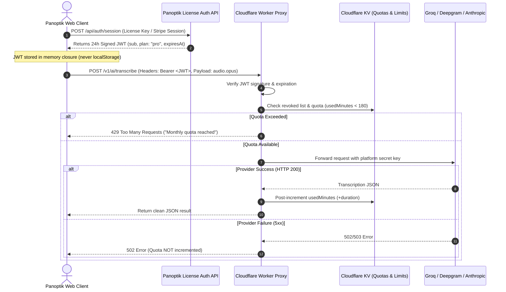
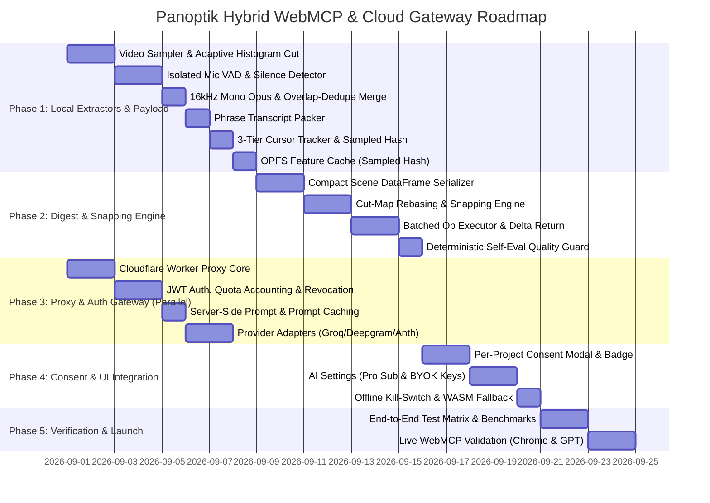

# Technical Specification: Semantic Video Digest, Hybrid Cloud AI & Batched WebMCP Architecture

> **Document Status**: Approved / Implementation-Ready Engineering Blueprint  
> **Author**: Panoptik Architecture Team  
> **Target Subsystems**: `packages/engine` (analysis, VAD, audio payload), `apps/web/src/webmcp` (batched tool protocol, snapping & cut-map rebasing), `apps/web/src/lib/ai` (provider adapters, proxy client, consent), `proxy/` (Cloudflare Worker auth, prompt caching & quota gateway).  
> **Core Tenets**:  
> 1. *100% client-side video decoding, Canvas 2D composition, and WebCodecs 4K export.*  
> 2. *Deterministic local feature heuristics (histograms, VAD silence, click stream, quadrant entropy).*  
> 3. *Opt-in cloud micro-APIs via secure stateless proxy (zero platform keys in client).*  
> 4. *Single-turn batched WebMCP agent protocol with source-media coordinate rebasing and partial-straddle clamping.*

---

## Table of Contents
1. [Executive Summary & Core Tenets](#1-executive-summary--core-tenets)
2. [Privacy & Consent Architecture](#2-privacy--consent-architecture)
   - [2.1 Brand & Product Identity (Rebrand, Don't Retract)](#21-brand--product-identity)
   - [2.2 Per-Project Consent Flow & Cloud-Touched Badge](#22-per-project-consent-flow)
   - [2.3 Hard Offline Kill-Switch & Air-Gapped Mode](#23-hard-offline-kill-switch)
   - [2.4 Provider Data Hygiene & Zero-Retention Compliance](#24-provider-data-hygiene)
3. [Token, Latency & Economic Truths](#3-token-latency--economic-truths)
   - [3.1 Honest E2E Latency Budget (10-Minute Video)](#31-honest-e2e-latency-budget)
   - [3.2 Unit Economics & 90–95% Contribution Margin Model](#32-unit-economics)
   - [3.3 Progressive Multi-Stage Digest (Zero-Blocking Editor)](#33-progressive-multi-stage-digest)
4. [Proxy, Auth & Quota Gateway Architecture](#4-proxy-auth--quota-gateway-architecture)
   - [4.1 Security & Key Custody](#41-security--key-custody)
   - [4.2 Cloudflare Worker Proxy Architecture](#42-cloudflare-worker-proxy-architecture)
   - [4.3 License Verification & Short-Lived In-Memory JWTs](#43-license-verification--short-lived-jwts)
   - [4.4 Rate Limiting & Post-Execution Quota Accounting](#44-rate-limiting--post-execution-quota-accounting)
   - [4.5 Server-Side System Prompt & Provider Prompt Caching](#45-server-side-system-prompt)
   - [4.6 BYOK Direct vs Pass-Through & CORS Verification Matrix](#46-byok-direct-vs-pass-through--cors-matrix)
5. [Tiering & Packaging: Free Open-Core vs Pro Cloud](#5-tiering--packaging-free-open-core-vs-pro-cloud)
   - [5.1 Clean Free vs Pro vs BYOK Boundary](#51-clean-free-vs-pro-vs-byok-boundary)
   - [5.2 6 Core Tools + 3 Tiered Tools Catalog](#52-6-core-tools--3-tiered-tools-catalog)
6. [Deterministic Feature Extraction & Audio Payload Spec](#6-deterministic-feature-extraction--audio-payload-spec)
   - [6.1 Audio Payload Spec (16kHz Mono Opus/FLAC & Overlap-and-Dedupe)](#61-audio-payload-spec)
   - [6.2 Local Heuristic Extractors & Adaptive Thresholding](#62-local-heuristic-extractors)
   - [6.3 3-Tier Cursor Stream Capture](#63-3-tier-cursor-stream-capture)
   - [6.4 Sampled 128KB Hash & OPFS Feature Cache](#64-sampled-128kb-hash--opfs-feature-cache)
   - [6.5 Local Whisper WASM Fallback Path](#65-local-whisper-wasm-fallback-path)
7. [Semantic Digest Format & Dataframe Serialization](#7-semantic-digest-format--dataframe-serialization)
   - [7.1 Compact Scene DataFrame Schema](#71-compact-scene-dataframe-schema)
   - [7.2 Packed Transcript Schema](#72-packed-transcript-schema)
   - [7.3 Global Context Header](#73-global-context-header)
8. [Batched WebMCP Tool Surface, Snapping & Execution Engine](#8-batched-webmcp-tool-surface-snapping--execution-engine)
   - [8.1 Consolidated Tool Interface](#81-consolidated-tool-interface)
   - [8.2 Coordinate System & Deterministic Batch Execution Order](#82-coordinate-system--deterministic-batch-execution-order)
   - [8.3 Snapping, Keepout & Collision Rules](#83-snapping-keepout--collision-rules)
   - [8.4 Deterministic `probe_frames` Contract](#84-deterministic-probe_frames-contract)
   - [8.5 Deterministic Self-Evaluation Quality Guard](#85-deterministic-self-evaluation-quality-guard)
9. [Multi-Phase Implementation Roadmap](#9-multi-phase-implementation-roadmap)
10. [Test Matrix & Quality Gates](#10-test-matrix--quality-gates)

---

## 1. Executive Summary & Core Tenets

Panoptik's architecture is anchored by four unbreakable design tenets:

1. **Video Pixels Never Leave the Device**: All video frame decoding, Canvas 2D composition, zoom math, transitions, and WebCodecs 4K hardware-accelerated rendering happen locally in the browser. Zero video upload bandwidth, zero cloud GPU rendering costs.
2. **Audio/Text Cloud AI is Strictly Opt-In**: Cloud transcription and auto-director LLM reasoning are optional performance accelerations. When activated, only resampled mono audio (2–4 MB) and the compact text digest (7 KB) are transmitted via a stateless proxy.
3. **No Platform Keys in Client Code**: All platform AI provider keys reside in an isolated Cloudflare Worker proxy (`proxy/`). Client requests authenticate via short-lived in-memory JWTs backed by Stripe/LemonSqueezy subscription verification.
4. **Zero-Cost Tools are Free Forever**: WebMCP tools that run locally (digest generation, scene queries, timeline snapping, staging, manual edits, and user-driven ChatGPT/Claude co-editing) are free and open-core. Pro tier pays exclusively for hosted cloud resources (sub-second cloud transcription, hosted LLM auto-director, studio voice enhancement).

---

## 2. Privacy & Consent Architecture

### 2.1 Brand & Product Identity
Instead of retracting the privacy guarantee, Panoptik sharpens it:
> **"Your video media never leaves your device. Cloud AI is 100% opt-in and processes only isolated audio and derived text metadata — never raw video pixels."**

### 2.2 Per-Project Consent Flow
1. **First-Use Consent Modal**: When any cloud feature (e.g. Cloud Whisper, AI Auto-Director) is invoked for the first time on a project, a clear dialog is displayed:
   - *"Send 16kHz audio (2.8 MB) to Panoptik Cloud (Groq/Deepgram) for sub-second transcription?"*
   - Explains zero data retention, no AI training, and that video frames remain on-device.
   - User choices: **[Enable for this Project]**, **[Use Local Offline AI]**, **[Cancel]**.
2. **Cloud-Touched Project Badge**:
   - Projects with cloud AI enabled display a subtle blue badge: `☁️ Cloud-Assisted (Audio only)`.
   - Purely offline projects display a green badge: `🔒 Local Only (Zero Network AI)`.

### 2.3 Hard Offline Kill-Switch
A global setting in `Settings > Privacy`:
- **"Air-Gapped / Local-Only Mode"**:
  - Drops all outbound network calls to cloud AI endpoints.
  - Hides cloud-only tools from the WebMCP catalog so external agents cannot trigger network requests.
  - Routes transcription requests to the local Whisper WebAssembly / WebGPU fallback worker.

### 2.4 Provider Data Hygiene & Zero-Retention Compliance
- **Zero-Retention API Contracts**: Panoptik's proxy uses enterprise zero-data-retention tiers (Groq, Deepgram, Anthropic API) where customer inputs are never stored, logged to disk, or used for model training.
- **License / Code Boundary**: The Cloudflare Worker proxy is maintained in an independent repository/package (`@panoptik/proxy`), preserving the clean AGPL-3.0 boundary on the frontend web application.

---

## 3. Token, Latency & Economic Truths

### 3.1 Honest E2E Latency Budget (10-Minute Video)

| Processing Step | Local WASM Whisper | **Panoptik Cloud Whisper v3 (Ours)** |
|---|---|---|
| 1. Local Audio Resample (16kHz Mono Opus/FLAC, 2–4 MB) | ~0.8s | **~0.8s** |
| 2. Upload Payload to Proxy (Average 25 Mbps uplink) | 0.0s (N/A) | **~1.5s – 2.5s** |
| 3. Provider Inference (Groq Whisper Large v3 @ 300× realtime) | 45.0s – 90.0s | **~1.2s – 2.0s** |
| 4. Return Payload & Digest Patch | 0.0s | **~0.4s** |
| **Total End-to-End Latency** | **45.8s – 90.8s** | **~3.9s – 5.7s (~15× faster)** |

### 3.2 Unit Economics & 90–95% Contribution Margin Model

```
Gross Revenue (Pro Tier): $19.00 / month
Stripe & Payment Fees (~6%): -$1.14
Net Revenue: $17.86 / month

Per-User Budgeting & Scenarios:
- Monthly Plan Limit Cap: 180 transcription-minutes / month
- Budgeted P50 Average: 120 transcription-minutes / month

P50 COGS Breakdown (12 × 10-min videos):
- 12 × 10-min Cloud Whisper calls (Groq @ $0.00005/s = $0.03/10-min): $0.36
- 12 × Multi-turn Auto-Director LLM calls (Gemini 1.5 Flash / Claude Haiku with Prompt Caching): $0.08
- Cloudflare Worker Proxy requests (~1,500 executions @ $0): $0.00
Total P50 COGS: $0.44 / month → Net Margin: $17.42 / month (92.5% Gross Margin)

P95 Worst-Case COGS (Full 180 min cap consumed):
- 18 × 10-min Cloud Whisper calls: $0.54
- 18 × Multi-turn Auto-Director LLM calls: $0.12
Total P95 COGS: $0.66 / month → Net Margin: $17.20 / month (90.5% Gross Margin)
```

**Abuse Prevention**:
- Overage above 180 minutes: $0.05 / 10-minute block or switch to BYOK.
- Max single-request duration bound: 45 minutes on proxy timeout; recordings $> 30\text{ min}$ chunked into 15-minute segments client-side.

### 3.3 Progressive Multi-Stage Digest (Zero-Blocking Editor)
The UI never waits for cloud APIs to become interactive:
1. **Stage 0 (Local & Instant, ~1.5s)**: Video color histograms, RMS VAD silence intervals, quadrant background entropy, and cursor click logs are computed locally in a Web Worker and immediately populate the editor timeline.
2. **Stage 1 (Asynchronous Patch, ~5s)**: Cloud Whisper returns word-level timestamps; the Packed Phrase builder updates the semantic digest and enables full transcript-driven auto-editing.

---

## 4. Proxy, Auth & Quota Gateway Architecture

### 4.1 Security & Key Custody
- **No Platform API Keys in Client Bundles**: The web app never touches Groq, Deepgram, OpenAI, or Anthropic keys.
- **Client Security Model**: Client holds only an ephemeral, signed 24-hour JWT token in memory closure.

### 4.2 Cloudflare Worker Proxy Architecture



### 4.3 License Verification & Short-Lived In-Memory JWTs
- **JWT Payload**:
  ```json
  {
    "sub": "usr_9f8a2b3c",
    "tier": "pro",
    "quotaLimitMinutes": 180,
    "exp": 1756684800
  }
  ```
- **State in Web App**: Stored in a module-level variable inside `apps/web/src/lib/ai/authClient.ts` (cleared on tab close). Never persisted in `localStorage` or exported project snapshots.
- **Revocation**: The proxy performs a fast KV lookup `revoked:<userId>` on each request to instantly block refunded/canceled subscriptions.

### 4.4 Rate Limiting & Post-Execution Quota Accounting
- **Post-Increment Rule**: Quota `usedMinutes` is incremented in Cloudflare KV **only after a successful HTTP 200 response** from the upstream provider. Failed requests never consume user minutes.
- **Eventual Consistency Notice**: Cloudflare KV is eventually consistent across global edge locations; concurrent bursts may exhibit minor tolerance ($\pm 1$ request), which is well within margin safety.
- **Rate Limiter**: Max 10 requests / minute per user/IP.

### 4.5 Server-Side System Prompt & Provider Prompt Caching
- **Server-Side Prompt**: To achieve **85%+ token discounts** across turns and users, the static editorial system prompt prefix resides **server-side inside the Cloudflare Worker proxy**.
- **Provider-Specific Caching**:
  - **Anthropic**: Proxy attaches `cache-control: { type: "ephemeral" }` headers to the static system prompt and digest prefix.
  - **Google Gemini**: Proxy utilizes explicit `cachedContents` resources or implicit prefix matching.
- **Payload**: The client sends only `{ digest: VideoDigest, userInstruction?: string }`.

### 4.6 BYOK Direct vs Pass-Through & CORS Verification Matrix

| Provider | Direct Browser CORS Supported? | Required Headers / Quirks | Recommended Panoptik Path |
|---|---|---|---|
| **Groq** | ✅ Yes | `Authorization: Bearer <gsk_...>` | Direct from browser or through proxy pass-through |
| **Deepgram** | ✅ Yes | `Authorization: Token <key>` | Direct from browser |
| **OpenAI** | ✅ Yes | `Authorization: Bearer <sk-...>` | Direct from browser |
| **Anthropic** | ⚠️ Header Required | `anthropic-dangerous-direct-browser-access: "true"` | Pass-through via Proxy (avoids browser security warning) |
| **Google Gemini** | ✅ Yes | `x-goog-api-key: <key>` | Direct from browser |

*BYOK Key Storage*: User's personal keys are stored in `localStorage` under `panoptik:byok_keys` with a clear UI disclaimer: *"Keys stored locally in browser storage for convenience; never sent to Panoptik servers or exported in project files."*

---

## 5. Tiering & Packaging: Free Open-Core vs Pro Cloud

### 5.1 Clean Free vs Pro vs BYOK Boundary

```
┌────────────────────────────────────────────────────────────────────────┐
│                      PANOPTIK COMMUNITY (FREE)                         │
│  - Full Screen & Camera Recording, Takes & Reshoots                    │
│  - Multi-Track Timeline, Canvas 2D Rendering & Smooth Split Transitions│
│  - Facecam Styling (Borders, Custom Colors, Drop Shadow / Glow)        │
│  - Local Heuristics: Histogram Scene Cuts, RMS Silence, Click Stream   │
│  - Free WebMCP Protocol (User's own ChatGPT / Claude drives tools)     │
│  - Hardware-Accelerated 4K MP4 / WebM WebCodecs Export                 │
│  - Optional Offline Local Whisper WASM Transcriber                     │
└────────────────────────────────────────────────────────────────────────┘
                                    │
                                    ▼ Upgrade for Speed & Convenience
┌────────────────────────────────────────────────────────────────────────┐
│                        PANOPTIK PRO ($19/MO)                           │
│  - Sub-Second Cloud Whisper Transcription (Word-level precision)       │
│  - 1-Click Hosted AI Auto-Director (Auto-cuts, zooms, backgrounds)     │
│  - Studio Voice AI Enhancement & Denoising                             │
│  - 180 Included Cloud Minutes / Month + Hosted Proxy Gateway           │
└────────────────────────────────────────────────────────────────────────┘
                                    │
                                    ▼ Or Bring Your Own Keys
┌────────────────────────────────────────────────────────────────────────┐
│                        PANOPTIK BYOK (DEVELOPER)                       │
│  - Free to use with personal Groq / OpenAI / Anthropic API keys        │
│  - Uncapped usage directly billed to user's provider accounts          │
└────────────────────────────────────────────────────────────────────────┘
```

### 5.2 6 Core Tools + 3 Tiered Tools Catalog

| Tool Name | Type | Access Tier | Cost to Us | Description |
|---|---|---|---|---|
| **`get_video_summary`** | Read-Only | **Free Forever** | $0 | Returns local scene dataframe, click logs, and packed transcript. |
| **`get_scene_detail`** | Read-Only | **Free Forever** | $0 | Lazy drill-down for single-scene click coordinates & word timestamps. |
| **`probe_frames`** | Read-Only | **Free Forever** | $0 | Returns deterministic text feature summaries of keyframes. |
| **`propose_edits`** | Staging | **Free Forever** | $0 | Batched edit staging taking `EditOp[]` array (`mode: "replace" \| "append"`). |
| **`commit_staged_changes`**| Action | **Free Forever** | $0 | Atomic diff confirmation & store commit. |
| **`discard_staged_changes`**| Action| **Free Forever** | $0 | Clears pending ghost proposals. |
| **`export_clip`** | Action | **Tiered (Free)** | $0 | Local WebCodecs export. |
| **`cloud_transcribe`** | Cloud AI | **Pro / BYOK** | Real $ | Calls Cloud Whisper via proxy in ~4s for word-level captions. |
| **`ai_auto_director`** | Cloud AI | **Pro / BYOK** | Real $ | Hosted 1-click auto-edit using Claude Haiku / Gemini Flash. |

*Note on Granular Tools*: Legacy granular staging tools (`propose_zoom_points`, `set_background`, etc.) are internal UI store actions and are **deliberately excluded** from the WebMCP tool catalog to keep standing schema overhead $< 1,300$ tokens.

---

## 6. Deterministic Feature Extraction & Audio Payload Spec

### 6.1 Audio Payload Spec (16kHz Mono Opus & Overlap-and-Dedupe)
- **Format**: 16,000 Hz, 16-bit Mono PCM encoded into **Ogg/Opus** at 32 kbps (or **FLAC**).
- **Payload Size**: ~2.4 MB – 3.2 MB for a 10-minute clip.
- **Long Recording Chunking (Overlap-and-Dedupe Protocol)**:
  - Recordings $> 30\text{ minutes}$ are split into 15-minute segments with a **2.0s unmixed overlap region**:
    - Chunk 1: $[00:00, 15:00]$
    - Chunk 2: $[14:58, 30:00]$
  - **Deduplication & Boundary Word Fuzzy-Merge**:
    1. Rebase Chunk 2 word timestamps by $+14:58$.
    2. In the overlap window $[14:58, 15:00]$, evaluate duplicated words: retain the word instance farther from its respective chunk boundary.
    3. If a word straddles the boundary as two partial tokens (e.g. `"expor"` at chunk 1 end and `"t"` at chunk 2 start), fuzzy-merge matching prefix/suffix pairs into a single word token.
    4. Concatenate streams into a single contiguous word list.

### 6.2 Local Heuristic Extractors & Adaptive Thresholding
Implemented in `packages/engine/src/analysis/`:
- **`videoFeatures.ts`**:
  - 1.5 fps canvas sampling via `VideoDecoder` / `OffscreenCanvas`.
  - 64-bin RGB color histogram with **Adaptive Robust Thresholding**:
    - Minimum scene duration: $1.5\text{s}$ (prevents flash cuts during scroll).
    - Cut threshold with hard floor:
      $$\text{threshold} = \max(\text{rollingMedian} + 2.5 \times \text{MAD}, 0.25)$$
      where $\text{MAD} = \text{median}(|\chi^2_i - \text{rollingMedian}|)$. Hard floor $0.25$ guards static degenerate videos where $\text{MAD} \to 0$.
  - Median-cut palette quantization into a compact 16-hue color index (`pal: 0..15`).
  - Motion energy: mean frame-diff classified into `motionCategory: "static" | "medium" | "high"`.
  - 4-quadrant edge entropy (`tl`, `tr`, `bl`, `br`) for facecam placement (`camCorner`).
  - **Centroid Collision Rule**: If `camCorner`'s PiP bounding box (5% frame area) intersects the scene's click centroid bounding box $[cx \pm 0.12, cy \pm 0.12]$, automatically select the second-lowest entropy corner.
- **`audioFeatures.ts`**:
  - **Track Isolation**: RMS energy windowing runs **strictly on the isolated microphone/dialogue track** (fallback to screen audio only if no mic track exists) to prevent background music from corrupting silence detection.
  - Silence intervals ($\ge 450\text{ ms}$) flagged as cut candidates.
  - Vocal emphasis peaks ($> 3.2\times$ rolling average) flagged with $\pm 200\text{ms}$ **No-Cut Keepout Zones**.

### 6.3 3-Tier Cursor Stream Capture
1. **Tier A (Instrumented Browser Tab / Extension)**: Real DOM event stream `[{ t, x, y, type: "click" | "move" }]`.
2. **Tier B (Computer Vision Template Tracker)**: Web Worker runs a template-matching cursor tracker over the 1.5 fps downsampled video stream to produce sparse centroid anchors (zooms rely on smooth easing interpolation over sparse samples).
3. **Tier C (Degraded / Screen-Only Fallback)**: When no cursor telemetry exists, emit `clicks: 0, centroid: null`. The snapping engine falls back to transcript emphasis + silence boundaries without crashing.

### 6.4 Sampled 128KB Hash & OPFS Feature Cache
- **Sampled Fast Hash**: Instead of hashing a 500 MB blob in memory (causing high memory spikes), compute:
  $$\text{Hash} = \text{FNV-1a}\Big(\text{size} + \text{duration} + \text{slice}(0, 64\text{KB}) + \text{slice}(\text{end}-64\text{KB}, \text{end})\Big)$$
- Read size is strictly $128\text{ KB}$; hashing executes in $< 2\text{ms}$.
- Features are persisted in OPFS under `/projects/<projectId>/analysis/<sampledHash>.json`.

### 6.5 Local Whisper WASM Fallback Path
- Retained in `apps/web/src/workers/whisperWorker.ts` using `@xenova/transformers` (Whisper Tiny/Base).
- Activated automatically when offline kill-switch is active or network request fails.

---

## 7. Semantic Digest Format & Dataframe Serialization

The semantic digest is structured like a lean dataframe, minimizing JSON key tokens.

### 7.1 Compact Scene DataFrame Schema

```json
{
  "scenes": [
    [0, 0.0, 12.4, "static", 7, 0, 0, "br"],
    [1, 12.4, 45.2, "high",   3, 8, 1, "bl"],
    [2, 45.2, 58.0, "medium", 9, 2, 0, "tr"],
    [3, 58.0, 72.5, "medium", 2, 5, 2, "bl"]
  ]
}
```
**Field Order**: `[id, t0, t1, motionCategory, paletteIndex(0-15), clicks, loudPeaks, bestCamCorner]`.  
*Token consumption: ~12 tokens per scene (verified with `gpt-tokenizer`).*

### 7.2 Packed Transcript Schema

```text
[00:00.0-00:04.2] Welcome to Panoptik, the browser-native demo editor.
[00:04.8-00:11.5] Today we're showing client-side video processing with WebCodecs.
[00:12.6-00:22.0] Let's zoom into the timeline to see our multi-track audio layout.
```
*Token consumption: ~20 tokens per packed phrase.*

### 7.3 Global Context Header
```json
{
  "project": {
    "id": "p_8f9a2",
    "duration": 72.5,
    "hasFacecam": true,
    "hasMic": true,
    "hasMusic": false,
    "silenceCount": 6,
    "deadAirSeconds": 14.8
  }
}
```

**Total Digest Token Count for 10-Minute Video**: **~6,200 tokens total** (Fits easily within standard LLM contexts with room for prompt caching).

---

## 8. Batched WebMCP Tool Surface, Snapping & Execution Engine

### 8.1 Consolidated Tool Interface

```typescript
export type EditOp =
  | { op: "cut"; t: number; dropSilence?: boolean; padLeftMs?: number; padRightMs?: number }
  | { op: "zoom"; t0: number; t1: number; cx?: number; cy?: number; scale?: number; ease?: "io3" | "out3" | "linear" }
  | { op: "trans"; at: number; kind: "fade" | "dipToBlack" | "slide-left" | "slide-right" | "zoom-in" | "wipe"; dur?: number }
  | { op: "cam"; t0: number; t1?: number; corner: "tl" | "tr" | "bl" | "br"; shape?: "circle" | "square"; size?: number }
  | { op: "bg"; t0: number; t1?: number; kind: "solid" | "gradient"; c0: string; c1?: string }
  | { op: "speed"; t0: number; t1: number; mult: 0.5 | 1.0 | 1.5 | 2.0 }
  | { op: "text"; t: number; text: string; pos?: "top" | "bottom" | "center"; dur?: number }
  | { op: "music"; trackId: string; startT: number; ducking?: number };

export type ProposeEditsArgs = {
  ops: EditOp[];
  plan: string;
  mode?: "replace" | "append"; // default "replace"
};
```

### 8.2 Coordinate System & Deterministic Batch Execution Order

> **Coordinate System**: All op timestamps are expressed in **source-media time** (the digest's coordinate system).

When multiple operations are submitted in a single batch, the client executes them in a strict **6-step deterministic sequence**:

```
1. VALIDATE: Validate all ops (parameter bounds, keepouts, positive timestamps).
2. RESOLVE CUTS: Compute all cut drop windows [s_i, e_i]. Sort and merge overlapping drops
   into a sorted cutMap: Array<{ start: number, end: number, droppedDur: number }>.
3. PARTIAL-STRADDLE CLAMPING & REJECTION:
   - If an op window [t0, t1] falls entirely inside a drop window [s_k, e_k]: reject op and report in diff.
   - If an op window [t0, t1] straddles a drop window [s_k, e_k]: clamp the op window to the surviving
     media span (e.g. clamp t1' = s_k if t0 < s_k < t1 <= e_k; clamp t0' = e_k if s_k <= t0 < e_k < t1).
     If clamped duration < 0.5s, drop op and report in diff.
4. REBASE SURVIVING OPS: Rebase every surviving timestamp t:
   t' = t − Σ(droppedDur of all dropped intervals entirely before t).
5. SPEED CONSTRAINTS (v1): A speed op's window may not overlap ANY other op's window (zoom, text, trans,
   cam, bg, music) — reject overlapping speed ops with an explicit diff message. Speed is applied last
   as a segment property.
6. APPLY IN ORDER:
   a. Apply cuts (splits & segment drops).
   b. Apply rebased zoom, cam, bg, text, trans, speed.
```

**Diff Reporting**: The delta response explicitly details rebases and clampings:
`"Staged: cut@34.2s (dropped 1.2s silence), zoom rebased 40.0s -> 38.8s (clamped from 40.0s-45.0s to 38.8s-43.8s), facecam positioned bottom-left."`

### 8.3 Snapping & Collision Rules
- **Rule 1 (Word Keepout)**: Never cut within $\pm 150\text{ms}$ of word start/end.
- **Rule 2 (Peak Keepout)**: Never cut within $\pm 200\text{ms}$ of an emphasis vocal peak.
- **Rule 3 (Centroid Snap)**: Zooms with omitted `(cx, cy)` automatically snap to the scene's click centroid.
- **Rule 4 (Transition Non-Overlap)**: Zoom holds must terminate at least $0.2\text{s}$ before a clip transition onset.

### 8.4 Deterministic `probe_frames` Contract
The free visual probe tool returns text-only feature descriptors:
```json
{
  "t": 14.2,
  "scene": 1,
  "features": "medium motion, dark UI (palette: 3), camCorner: bl",
  "context": "phrase: 'Click the export button' (13.9s-14.9s) | 3 clicks near (62%, 35%)"
}
```

### 8.5 Deterministic Self-Evaluation Quality Guard
- Automatically evaluates the timeline after `propose_edits` is staged:
  1. **Flash-Frame Check**: Any segment $< 0.25\text{s}$ is merged into neighboring segment.
  2. **Audio Micro-Fades**: Verifies $30\text{ms}$ zero-crossing audio micro-fades at cut boundaries to prevent clicks.
  3. **Zoom Duration Bounds**: Verifies all zooms hold for $[0.8\text{s}, 6.0\text{s}]$.
- **Loop Boundary**: Hard cap of **max 1 self-correction turn** to prevent agent reasoning loops.

---

## 9. Multi-Phase Implementation Roadmap



---

## 10. Test Matrix & Quality Gates

| Test Suite | Test File | Target Validation |
|---|---|---|
| **Adaptive Scene Detector** | `packages/engine/src/analysis/videoFeatures.test.ts` | $\chi^2$ adaptive cut detection ($\max(\text{rollingMedian}+2.5\times\text{MAD}, 0.25)$); min $1.5\text{s}$ scene length; scroll false-positive resistance; centroid PiP collision avoidance. |
| **Isolated Mic VAD** | `packages/engine/src/analysis/audioFeatures.test.ts` | Silences $\ge 450\text{ms}$ detected; vocal emphasis peaks generate $\pm 200\text{ms}$ keepouts; background music on screen track ignored. |
| **Audio Chunk Merge** | `packages/engine/src/analysis/audioPayload.test.ts` | Overlap-and-dedupe with fuzzy boundary word merge; no words span split boundaries post-merge. |
| **Sampled Hash Cache** | `packages/engine/src/analysis/cache.test.ts` | Sampled 128KB hash generates stable key without loading entire 500MB blob into RAM. |
| **Cut-Map Rebasing & Clamping** | `apps/web/src/webmcp/snapping.test.ts` | Cut dropping 1.2s rebases zoom from 40.0s to 38.8s; partially straddling zoom clamped to drop start; overlapping speed ops rejected with explicit diff report. |
| **Deterministic Self-Eval** | `packages/engine/src/analysis/selfEval.test.ts` | Detects flash frames ($< 0.25\text{s}$), boundary clicks, and zoom holds $< 0.8\text{s}$. |
| **Degraded Modes** | `apps/web/src/webmcp/degraded.test.ts` | Test 3 degradation modes: No mic $\to$ screen audio; No WebGPU $\to$ WASM fallback; No cursor $\to$ `clicks: 0` fallback. |
| **Proxy Gateway** | `proxy/test/gateway.test.ts` | JWT verification, post-increment quota in KV on HTTP 200, 429 rate limiting, provider failover. |
| **Consent & Kill-Switch**| `apps/web/src/lib/ai/consent.test.ts` | Local-only mode blocks network requests; project cloud badge state persistence. |
| **WebMCP Protocol** | `apps/web/src/webmcp/validation.test.ts` | Consolidated 6 core + 3 tiered tools registration, lifecycle cleanup, telemetry event timing, delta response formatting. |
